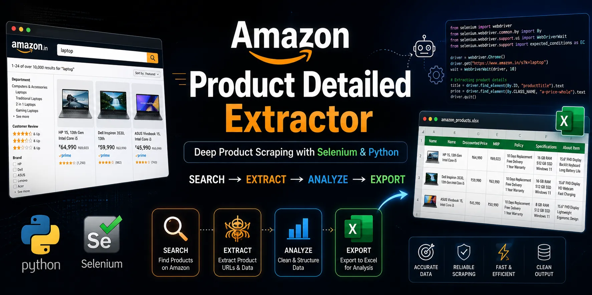

# Amazon Product Detailed Extractor

A production-focused Selenium automation project that scrapes detailed product information from Amazon India based on a user search query.

This scraper performs end-to-end extraction:

* Searches products on Amazon
* Extracts all search result page URLs
* Extracts product URLs from all pages
* Visits every product page
* Scrapes detailed product information
* Exports structured data to Excel sorted by product price

---

## Features

* Automated product search on Amazon India
* Search result pagination handling
* Product URL extraction across all pages
* Deep product page scraping
* Excel export with automatic sorting
* Duplicate product removal
* Progress tracking logs
* Execution time measurement

---

## Extracted Data

The scraper collects the following information for each product:

* Product Name
* Discounted Price
* MRP
* Policy Information
* Product Specifications
* About Product Details

Example extracted fields:

### Product Name

HP 15 Smartchoice Laptop

### Discounted Price

₹51,990

### MRP

₹69,023

### Policy

* 10 Days Replacement by Brand
* Free Delivery
* 1 Year Warranty Care
* Pay on Delivery

### Specifications

* Brand: HP
* Operating System: Windows 11
* RAM: 16 GB
* CPU Model: Intel Core i5

### About Product

* Display details
* Performance details
* Battery details

---

## Tech Stack

* Python
* Selenium
* Pandas
* OpenPyXL

---

## Project Structure

```bash
amazon-product-detailed-extractor/
│
├── src/
│   ├── main.py
│   ├── page_extractor.py
│   ├── product_url_extractor.py
│   ├── product_details_extractor.py
│   └── exporter.py
│
├── output/
│
├── requirements.txt
└── README.md
```

---

## Workflow


```text
User Input Product Name
        ↓
Extract Search Result Pages
        ↓
Extract Product URLs
        ↓
Extract Product Details
        ↓
Export to Excel
```

---

## Installation

Clone repository:

```bash
git clone <repository-url>
cd amazon-product-detailed-extractor
```

Create virtual environment:

```bash
python -m venv venv
```

Activate environment:

Windows:

```bash
venv\Scripts\activate
```

Linux / Mac:

```bash
source venv/bin/activate
```

Install dependencies:

```bash
pip install -r requirements.txt
```

---

## Requirements

```txt
selenium
pandas
openpyxl
```

---

## Usage

Run:

```bash
python src/main.py
```

Input:

```text
Enter the product name: laptop
```

Example output:

```text
Extracting page URLs...
Extracting product URLs...
Extracting product details...
Saving to Excel...
Excel saved successfully: laptop_products.xlsx
```

Generated Excel file:

```text
laptop_products.xlsx
```

---

## Output Format

The final Excel sheet contains:

| Name | Discounted Price | MRP | Policy | Specifications | About Item |
| ---- | ---------------- | --- | ------ | -------------- | ---------- |


---

## Key Challenges Solved

* Amazon pagination handling
* Multi-page scraping
* Dynamic product page structure
* Missing data handling
* Duplicate product filtering
* Price-based sorting

---

## Limitations

* Amazon DOM changes frequently
* Some selectors may break after UI updates
* Product layouts vary across categories
* Large product searches may take significant time

This scraper may require selector updates in future.

---

## Future Improvements

* Multi-threaded scraping
* Proxy support
* Anti-bot detection handling
* Resume failed scraping jobs
* Database integration
* Streamlit dashboard

---

## Learning Outcomes

This project demonstrates practical experience in:

* Selenium automation
* Browser automation
* Dynamic web scraping
* Data cleaning
* Data export automation
* Production-grade Python scripting

---

## Disclaimer

This project is intended for educational and automation learning purposes only.
Use responsibly and respect Amazon’s terms of service.
